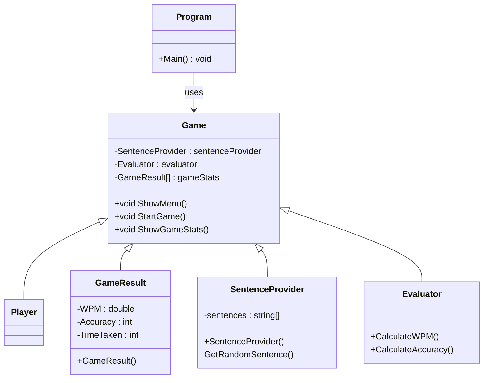

```mermaid
classDiagram
class Program {
    +Main() void
}

class Game {
    -SentenceProvider : sentenceProvider
    -Evaluator : evaluator
    -GameResult[] : gameStats
    +void ShowMenu()
    +void StartGame()
    +void ShowGameStats()
}

class SentenceProvider {
    -sentences : string[]
    +SentenceProvider()
    GetRandomSentence()
}

class GameResult {
    -WPM : double
    -Accuracy : int
    -TimeTaken : int
    +GameResult()
}

class Evaluator {
    +CalculateWPM()
    +CalculateAccuracy()
}

Program --> Game : uses
Game <|-- Player
Game <|-- GameResult
Game <|-- SentenceProvider
Game <|-- Evaluator
```